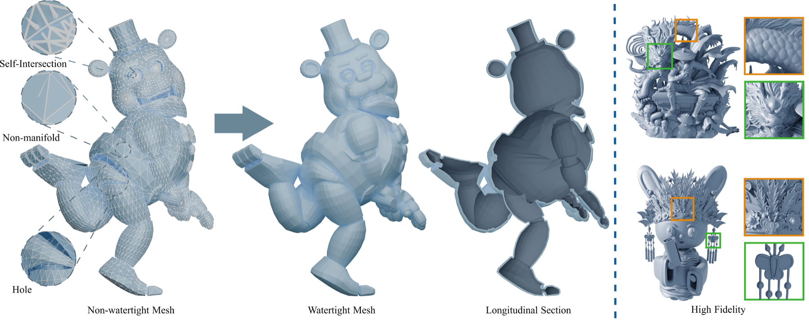
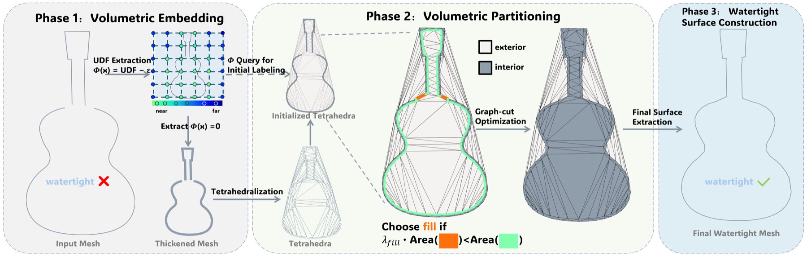
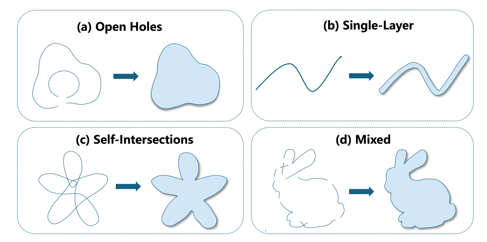
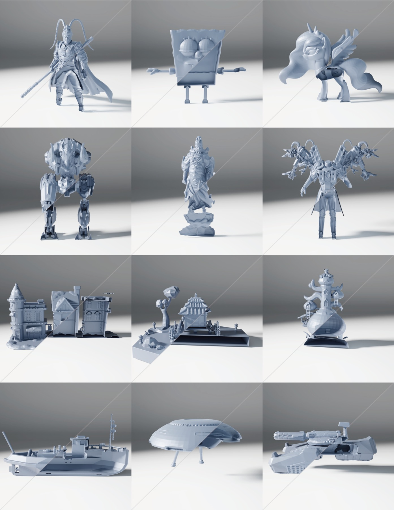

<h1 align="center">CelloCut:<br>Constructive Watertight Remeshing via Tetrahedral Cell Cuts</h1>

<p align="center">
  <a href="https://arxiv.org/abs/2605.17853"></a>
  <a href="https://rangeryx-66.github.io/CelloCut/"></a>
  <a href="https://huggingface.co/datasets/rangeryx2005/CelloCut_Benchmark"></a>
  <a href="https://github.com/rangeryx-66/CelloCut"></a>
  <a href="LICENSE"></a>
</p>

<p align="center">
  
</p>

<p align="center">
  Xuan Yang<sup>1,*</sup>, Yuhang Zeng<sup>1,*</sup>, Dinglong Fang<sup>1,*</sup>,
  Guochuan Tang<sup>1</sup>, Jiaju Jiang<sup>2</sup>, Ben Li<sup>2</sup>,
  Wei Zhou<sup>2</sup>, Xiao-Xiao Long<sup>1,&dagger;</sup>,
  Cheng Lin<sup>3,&dagger;</sup>
</p>

<p align="center">
  <sup>1</sup>Nanjing University &nbsp; · &nbsp;
  <sup>2</sup>China Mobile Zijin (Jiangsu) Innovation Research Institute Co., Ltd. &nbsp; · &nbsp;
  <sup>3</sup>Macau University of Science and Technology<br>
  <sup>*</sup>Equal contribution &nbsp; · &nbsp;
  <sup>&dagger;</sup>Corresponding authors
</p>

Official implementation of **CelloCut**, a constructive framework for turning defective meshes into compact, strictly watertight solids.

## TL;DR

CelloCut treats watertight remeshing as a **volumetric partitioning** problem instead of local surface repair. It embeds an imperfect input mesh into a tetrahedral cell complex, solves a graph-cut labeling problem with fill-aware penalties, and extracts a watertight surface by construction.

## Highlights

- **Strictly watertight outputs** for meshes with holes, self-intersections, non-manifold elements, and thin ambiguous structures.
- **Constructive volumetric formulation** over tetrahedral cells, with a globally consistent inside-outside interpretation.
- **Paper-aligned defaults**: `512^3` UDF grid, `epsilon=1/512`, `decimate_ratio=0.95`, and `lambda_fill=20`.
- **Single-model and batch inference** through compact Python entry points.

## Method

We introduce CelloCut, a constructive watertight remeshing framework for defective meshes whose surfaces no longer define a reliable solid. Instead of repairing holes, self-intersections, non-manifold configurations, and single-layer regions with local surface operations, CelloCut formulates the task as a volumetric partitioning problem: each tetrahedral cell in space is assigned an interior or exterior label, and the final mesh is extracted as the boundary induced by this optimized partition.

CelloCut first constructs a conservative thickened proxy from the input mesh using an unsigned distance field and a small offset thickness. This proxy provides stable volumetric evidence even when the original surface is open, intersecting, or locally ambiguous. We then tetrahedralize the proxy domain and initialize cell labels from the thickened geometry. A graph-cut optimization resolves uncertain regions under one-sided constraints that preserve proxy-supported interiors and fill-aware interface penalties that discourage unsupported newly introduced boundaries. The resulting partition gives a globally consistent inside-outside interpretation, and the final surface is watertight by construction.

<p align="center">
  
</p>

### Problem Setting

Open holes, single-layer sheets, self-intersections, and mixed corruptions make local surface repair unreliable because the input no longer determines a unique interior volume. In these cases, exact surface restoration is often underconstrained; the practical goal is to choose a conservative solid interpretation that is compact, manifold, and volumetrically consistent.

<p align="center">
  
</p>

## Results

<p align="center">
  
</p>

## Installation

The code has been tested on Linux with Python 3.10.18 and CUDA 12.4.

```bash
conda create -n CelloCut python=3.10
conda activate CelloCut
bash build.sh
```

`build.sh` installs the Python requirements, builds the CUDA UDF extension in `cumesh2sdf`, installs CGAL-related dependencies from conda-forge, and compiles the C++/CUDA extension into `build/`.

If CGAL is installed outside the active conda environment, set `CGAL_DIR` before building:

```bash
export CGAL_DIR=/path/to/lib/cmake/CGAL
bash build.sh
```

## Usage

Run CelloCut on a single mesh:

```bash
python example.py --input assets/bad_doll.obj --output results/output.obj
```

Run CelloCut on a directory of OBJ files:

```bash
python example_batch.py --input_dir path/to/input_objs --output_dir path/to/results
```

### Arguments

| Argument | Default | Description |
| --- | --- | --- |
| `--input` | `assets/bad_doll.obj` | Input mesh path for single-model inference. |
| `--output` | `results/output.obj` | Output mesh path for single-model inference. |
| `--input_dir` | `dataset/benchmark` | Input directory for batch inference. |
| `--output_dir` | `dataset/ours` | Output directory for batch inference. |
| `--voxel_res` | `512` | UDF grid resolution. The paper uses a `512^3` grid. |
| `--decimate_ratio` | `0.95` | Fraction of proxy mesh faces removed before tetrahedralization. |
| `--lamda_fill`, `--lambda_fill` | `20` | Filling regularization weight, denoted as `lambda_fill` in the paper. |

## Benchmark

The CelloCut benchmark is available on Hugging Face:

[https://huggingface.co/datasets/rangeryx2005/CelloCut_Benchmark](https://huggingface.co/datasets/rangeryx2005/CelloCut_Benchmark)

## Citation

```bibtex
@article{yang2026cellocut,
  title   = {CelloCut: Constructive Watertight Remeshing via Tetrahedral Cell Cuts},
  author  = {Yang, Xuan and Zeng, Yuhang and Fang, Dinglong and Tang, Guochuan and Jiang, Jiaju and Li, Ben and Zhou, Wei and Long, Xiao-Xiao and Lin, Cheng},
  journal = {arXiv preprint arXiv:2605.17853},
  year    = {2026},
  url     = {https://arxiv.org/abs/2605.17853}
}
```

## Third-Party Components

This repository includes third-party components under their original licenses. In particular, `cumesh2sdf` is licensed under Apache-2.0, and the code under `third_party/` keeps its upstream Eigen and libigl license terms. The metric utilities in `metric.py` are adapted from PyTorch3D/Facebook code and retain the original copyright notice.

## License

The CelloCut source code is released under the Apache License 2.0. See [LICENSE](LICENSE) for details. Third-party components retain their own licenses.
